# Git and Github

Git is an important tool that allows developers to track and store versions of content and enables you to collaborate and share code with others.

## Git and Github Table of Contents

| Command                       |                        Description                         |   Cool |
| ----------------------------- | :--------------------------------------------------------: | -----: |
| [`git version`](#Git-Version) |                     Check Git Version                      | Basics |
| [`git status`](#Git-Status)   |      Gives information on the current status of repo       | Basics |
| [`git init`](#Git-Init)       | Lets us to turn any existing project into a Git repository | Basics |
| [`git commit`](#Git-Commit)   |            Commit changes from the staging area            | Basics |
| [`git add`](#Git-Add)         |           Add specific files to the staging area           | Basics |

## Basics of Git

### Git Version

`git --version` - To check version of git currently installed
`git config --global init.defaultBranch main` - To change default branch of git to main from master

### Git Status command

`git status` - git status gives information on the current status of a git repository and it's contents. It is a harmless command

Possible Error messages you may encounter

- fatal: not a git repository (or any of the parent directories): .git
  - This just means that your don't have git setup on the project
    - You will have to initialize a git repository with [`git init`](#Git-Init)

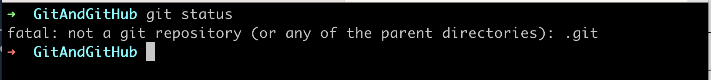

### Git Init

`git init` - Lets us to turn any existing project into a Git repository. Before we can do anything git-related, we must initialize a git repo first! Done once per poject.

- Notice how now we see `git:(main)`? This shows that the folder is now a git repo.

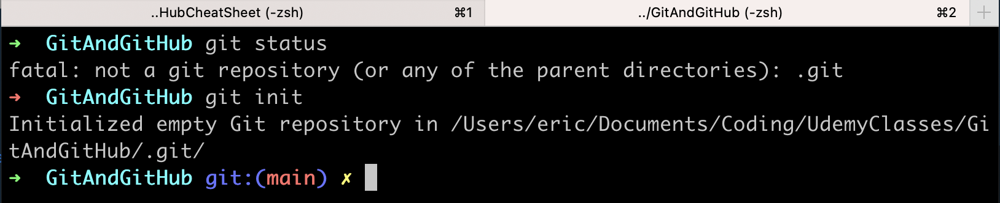

Also note that git files are hidden
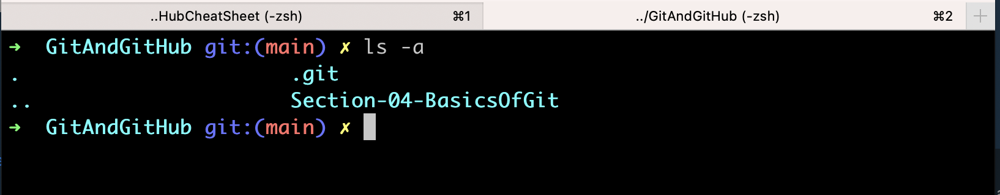

Warning!
Running `rm -rf .git` in your project folder will removes all the git stuff form the folder
Also don't run `git init` inside a folder that already has git. Always make sure you are not in a git repo already.

- Run `rm -rf .git` if you initialize a git repo side a folder that already has git setup

### Git Commit

`git commit` - are "checkpoints" - command to actually commit changes from the staging area.

`git commit -m "insert message here" - The -m flag allows us to pass in an inline commit message, rather than launching a text editor

- When making a commit, you need to provide a commit message that summarizes the changes and work snapshotted in the commit
  - Always use present-tense imperative style as convention
- If you get stuck in VIM editor because you typed in "git commit" then `:q` to exit

`git commit -a -m` - is short version of adding and committing in one line

Note that `git status` will let you know of untracked changes when you are working on a file and will know of new files.
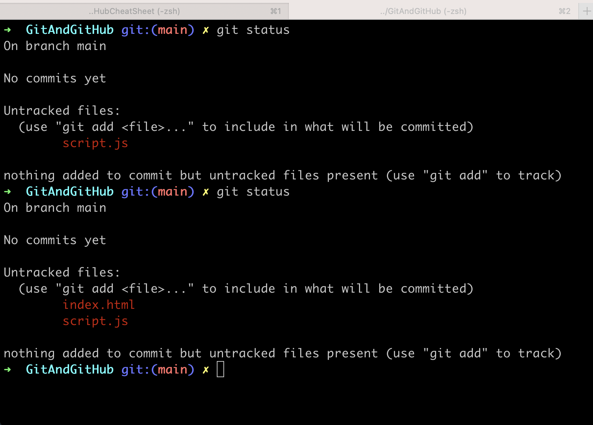

Here we see git committed and a clean working tree
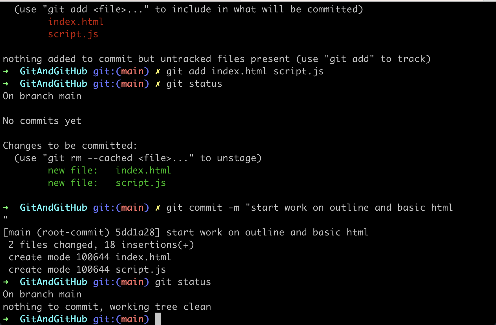

### Git Add

`git add` - Add specific files to the staging area. Separate files with spaces to add multiple at once
`git add .` - will stage all changes at once. We use this less because we want to be more precise on what we are adding.

- Notice how files went from red to green? The files are now added to staging area
  

### Git Log

`git log` - Provides us a log of all our commits and messages
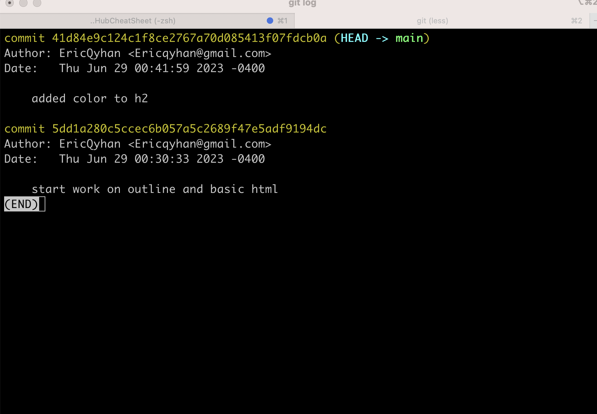

`git log --oneline` - turns out git log into one short line
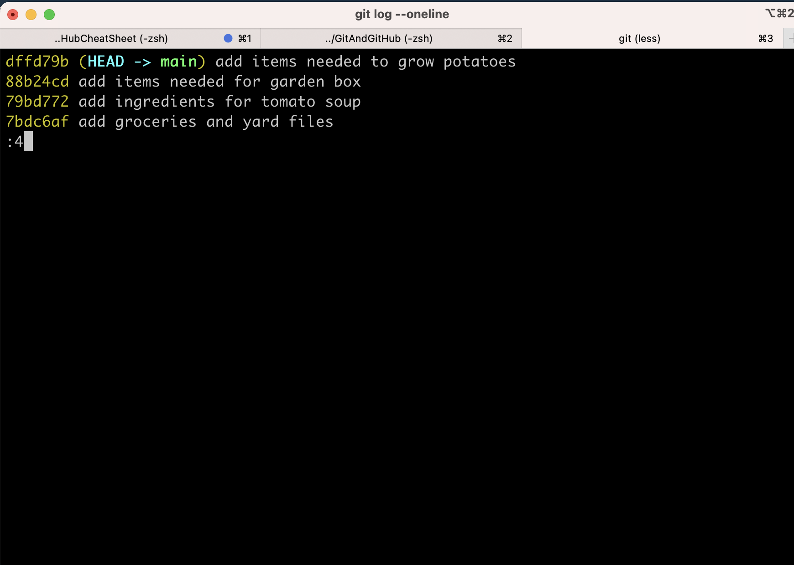

## Git Commits In Detail

## Atomic Commits

Note that commits should encompass a single feature, change, or fix. Keep each commit focused on a single thing. It will make it much eaier to undo or roolback changes later on. Code will also be easier to review.

## Configuring VS Code to your Default Editor

`git config --global core.editor "code --wait"`
[Change VS Code to Git Editor](https://git-scm.com/book/en/v2/Appendix-C%3A-Git-Commands-Setup-and-Config)

**_ Warnings you may encounter with this _**
"hint: waiting for your editor to close the file... code --wait: code" command not found. Error: there was a problem with the editor 'code --wait". Please supply the message using either -m or -F option."

Go to VS Code and type in `>code` to install Shell Command" Install `code` command

### Amending Commits

`git commit --amend` lets us "redo" the previous commit. This is good of there is a type on the commit message or forgot to add a file. Only works on last commit.

You see here we updated groceries.txt and yard.txt, but I only added groceries.txt to my commit. From here i can do another another `git add yard.txt` and then `git commit`. From here we will have VS Code open and we can make our message edit and save it.

Note to always add and commit changes before you switch branches.

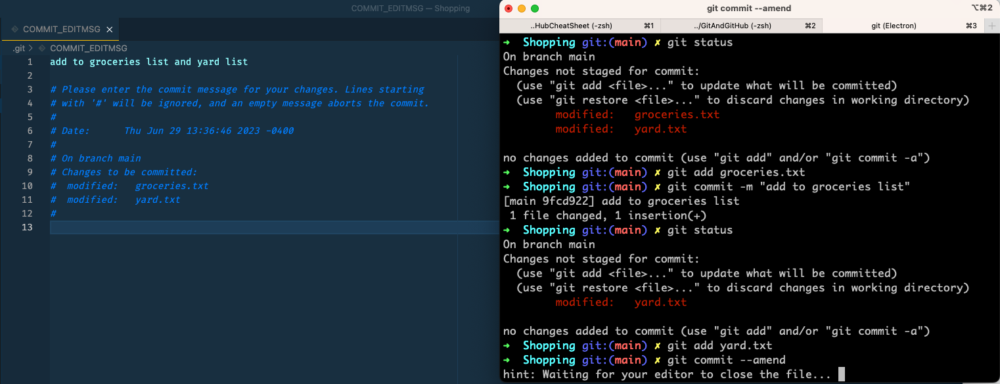

After we save it we will see that it was committed with a updated message
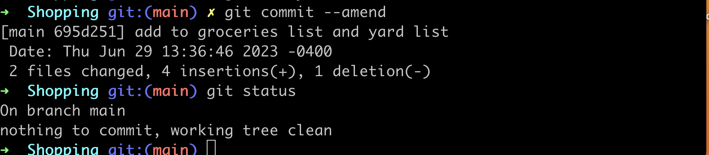
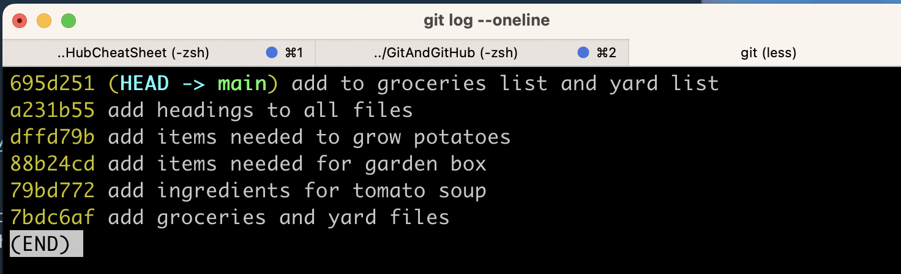

### Git Ignore

Inside our .gitignore file we can store secrets, API Keys, credentials, Operating system files, log files, dependencies, and packages.

### Git branch -d <branch name>

`git branch -d <branch name>` - to delete a branch. You can't be in the same branch when deleting.

### Git branch

## Git Branches

The Master/Main Branch - Default branch in git is called the master/main branch. Nothing special about it.

Sometimes the Master/Main branch is the official branch and working branch. Everything is build in other branches and if new code works on other branches, it is then moved to master.

## Head

**Head** is a pointer that refers to the current "location" in your repo history. It points to a particular branch reference.
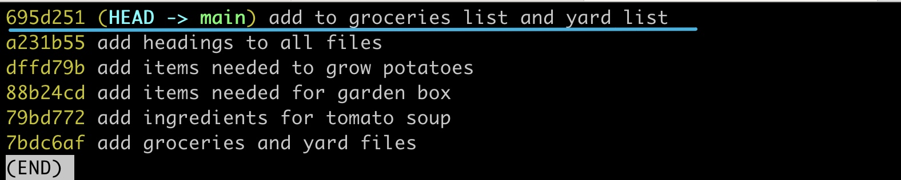

## Git Branch

`git branch` - to view existing branches. Look for the `*` which indicates the branch you are currently in.

## Git branch <branch name>

`git branch <branch-name>` - We create a new branch. Example `git branch oldies` to create a branch name oldies. We see that head is pointing to Master and we also have another branch named oldies

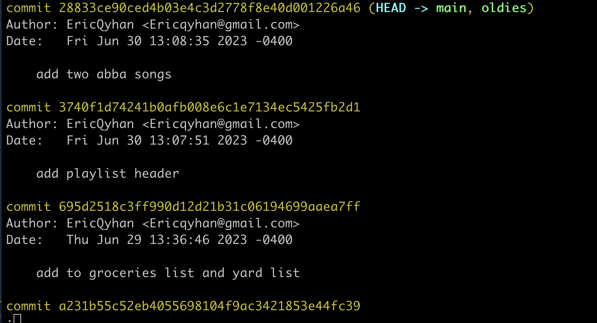

## We use Git Switch to switch branches

`git switch <branch name>` Example would be `git switch oldies` to switch to Oldies branch. Here we see that we switched to oldies and that did a `git log` to see that head is now pointing to oldies branch.

`git switch -c <branch-name>` to create a new branch and switch into it

## Rename a branch

`git branch -m <new branch name>` - switch to branch you want to rename and run `git branch -m <new branch name>`
