# GitAndGithubCheatSheet

## Git Intro Table on Contents

git commit -a -m "commit message"

| Description                                            | Command                                         |
| ------------------------------------------------------ | ----------------------------------------------- |
| **First Step**                                         |
| Create a new git repository.                           | [`git init`](#git-init)                         |
| Create Status                                          | `git status`                                    |
| **Git Commits**                                        |
| Add and commit in same line                            | `git commit -a -m "commit message"`             |
| Create a new git repository.                           | [`git commit --ammend`](#Amending-Commits)      |
| **New Branches**                                       |
| See what branches are available                        | [`git branch`](#Viewing-Branches)               |
| See what branches are available with more info         | `git branch -v`                                 |
| **Switch Branches**                                    |
| Creating a Branch and switching to it                  | [`git switch -c`](#Switching-with-Git-Checkout) |
| Switching to a branch                                  | `git Switch`                                    |
| **Git Stashing**                                       |
| Stashing uncommitted changes before switching branches | [`git stash`](#Section-9:-Git-Stash)            |
| Apply most recently stashed change to current branch   | `git stash pop`                                 |

## Section 4: Basics of git: Adding and Committing

`git status` - gives information on current status of a git repository and it's contents

#### git init

`git init` - creates a new git repository. Before we can do anything git-related, we must initialize a git repo first! Done once per poject.

`git commit` - are "checkpoints" - command to actually commit changes from the staging area
<br>
If you get stuck in VIM editor because you typed in "git commit" then to exit it will be ":q"

`git log` - retrieves logs of the commits
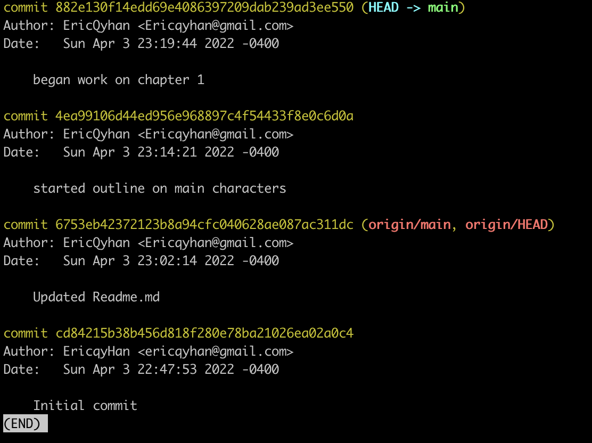

## Section 5: Commits in Detail

### Atomic Commits

When possible, a commit should encompass a single feature, change, or fix. In other words, try to keep each commit focused on a single thing. This makes it much easier to undo or rollback changes later on. It also makes your code or project easier to review.

- keep each commit focused on "ONE" feature
- Make sure to keep the first line the summary if you have a multiline commit message. This will help with commit history.

### Present Tense or Past Tense?

- Describe changes in imperative mood, "Make xyzzy do frotz" instead "Makes xyzzy do frotz, as if you are giving orders to the codebase to change its behavior.

### Escaping VIM

- If typed in "git commit" by accident and asked to enter a commit message all you have to do it type "i" to enter a commit message or type `:wq` and hit enter.
- We do this when we are on a big project and want to type in a large commit message.
- Use VS code as an editor instead.
- Use code snippet below to change VS Code to default VIM editor
- Note to make sure you have installed "code" command in VS code or the above snippet might not work.

```
git config --global core.editor "code --wait"
```

Type out your commit message, save, and close out of the commit window and your commit will be pushed

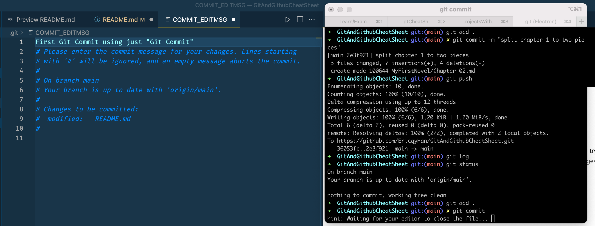

### A Closer Look at Git Log Command


git log --oneline


### Amending Commits

Ammending commits with `git commit --ammend`

- Supposed you just made a commit and then realized you forgot to include a file. Or, maybe you made a type int he message that you wanted to correct.
- Rather than making a brand new separate commit, you can just "redo" the previous commit using the --amend option
- Only works for the previous commit

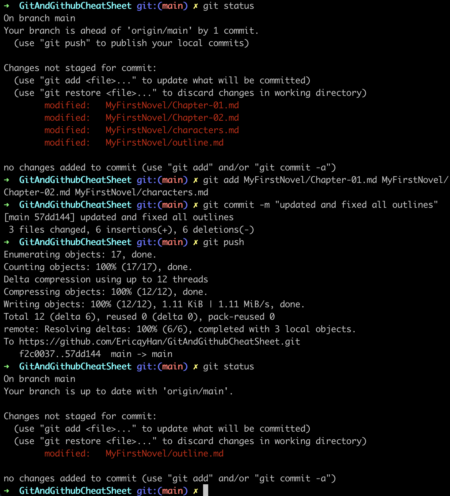

- Here we see we made edits to to MyFirstNovel/Chapter-01.md, MyFirstNovel/Chapter-02.md, MyFirstNovel/characters.md, and MyFirstNovel/outline.md.

- We committed everything but MyFirstNovel/outline.md
- `git commit --ammend` will help save the day
- 
- Remember: This only works for the previous commit.
- A VIM window will open after you "git add "new file" and git commit -- ammend" and you will be able to make edits to your commit message.
- 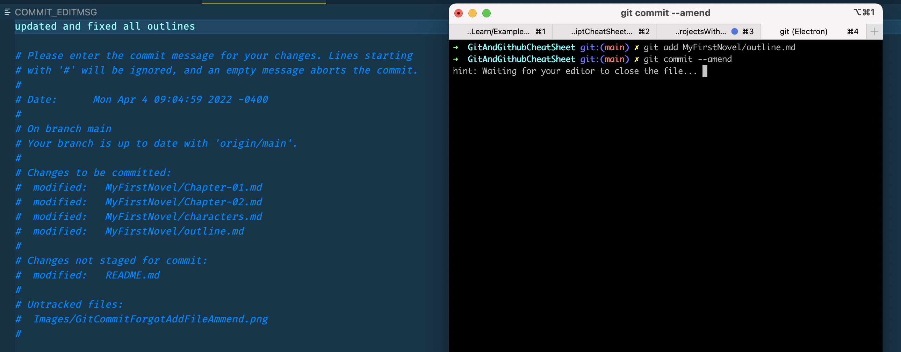
- Close the window when you are ready to commit

### Ignoring Files

- Good for API keys, credentials, operating system files, log files, dependencies and packages

- use a file named .gitignore
- .DS_Store will ignore files named .DS_Store
- folderName/ will ignore an entire directory
- \*.log will ignore any files with the .log extension


- secrets.md will not be added

## Section 6: Working With Branches

- Master was named Main back in 2020 and it is the default branch name. There is nothing special about it.
- Think of branches as bookmarks in a book and only one can be opened.
- Branch pointer - wherea branch is

### Viewing Branches

`git branch` to view you existing branches or `git branch -v` to see a little more info. The defualt default branch in every git repo is main, thought you can configure this.

- type `q` to get out of branch

### Creating New Branch

`git branch <bugfix>` - enter new name of branch between <>
`git branch` - to see branches available

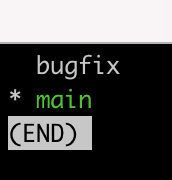

### Switching between branches

`git switch <branch name>`

`git commit -a -m "commit message"` - is a shortcut way to add and commit all unstaged changes

- Note that where you branch from matters.
  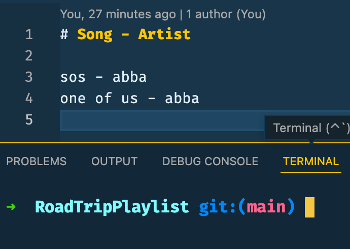

- Switching to Oldies branch
- 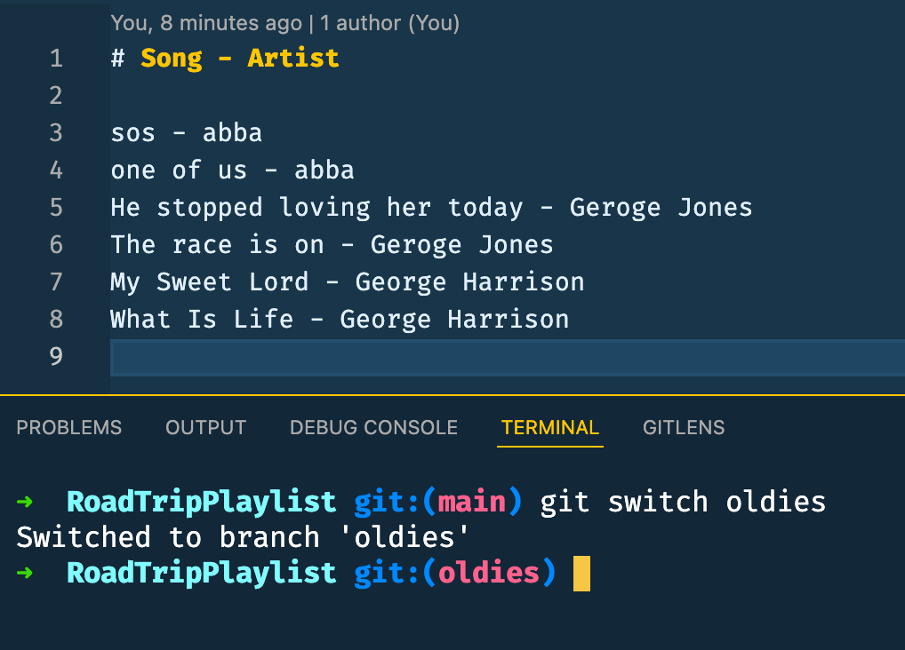

- Switching to Georges branch
- - 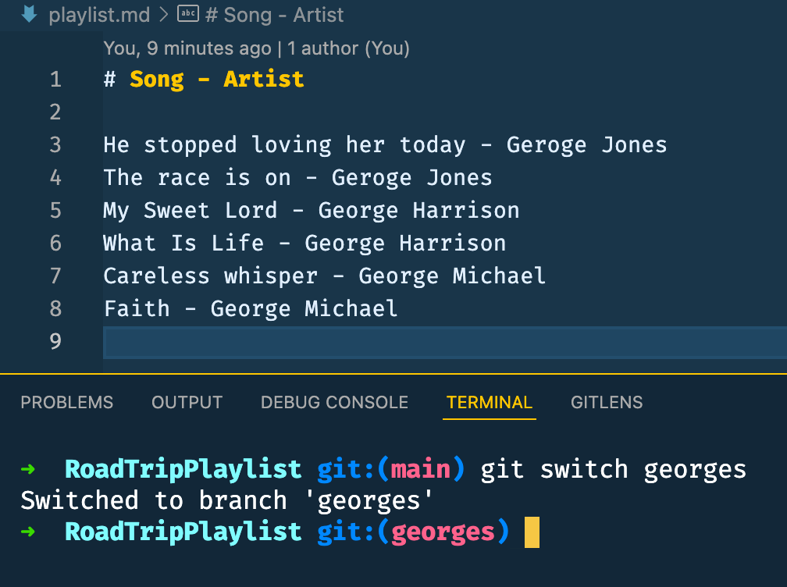

### Switching with Git Checkout

Git checkout commands does a million additional things, so decision was made to add a standalone switch command which is much simpler.

OR

We can also use `git switch -c <branch name>` as a shortcut for creating and switching to a new branch
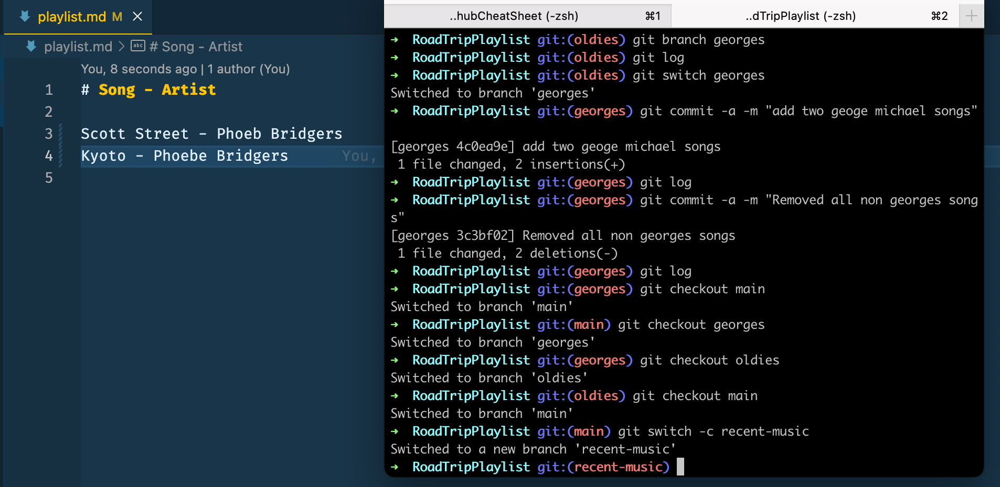

### Switching with unstaged changes

Note that you will get an error if you try to switch to a different branch before you save it. So make sure to save and commit everything before switching to a new branch.

- Always add and commit changes before switching branches

### Deleting and Renaming Branches

Use `git branch -D` to delete branches

Use `git branch -m <new name>` - while you are in the branch you want to rename

## Section 7: Merging Branches

Merging - Branching makes it super easy to work within self-contained contexts, but often we want to incorporate changes from one branch to another.

- We can do this with the `git merge` command

Remember these two meging concepts:

- we merge branches, not specific commits
- we always merge to the current HEAD branch

### Fast Forward Merge

- Remember that when we are doing a fast forward merge we are just having 'main branch' catch up on thse commits that we added to our current branch
- We are just fast forwarding "Master two branches ahead"
  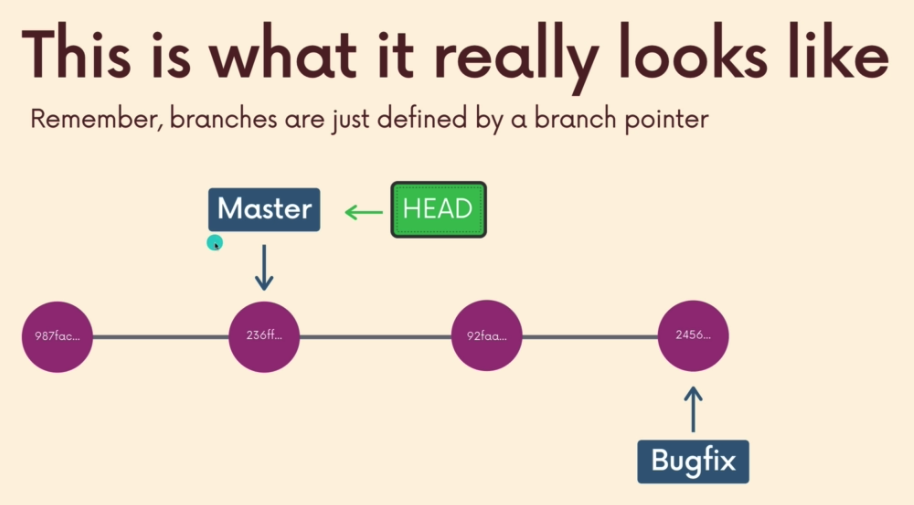
- Remember to switch into the destination branch that we are merging into
- Switch into master with `git switch master` assuming we are merging into master.

### Merging Branches

Switch to branch you want everything merged into and type `git merge <branch name>`

### Generating Merge Commits

Note that not all merges are fast forward merges

### Merge Conflicts

- Depending on the specific changes you are trying to merge, git may not be able to automatically merge. This results in merge conflicts, which you need to manually resolve.
  

  Dealing With Merge Conflicts

  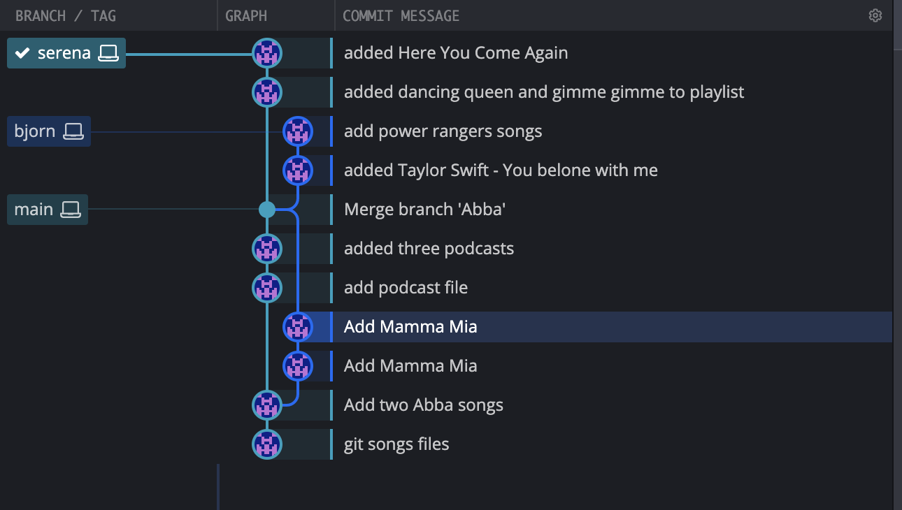
  Here we can see we made two different commits from two different branches.

  ```
  /// Playlist for Serena
  SOS - Abba
  One of Us - Abba
  Mamma Mia - Abba
  Dancing Queen - Abba
  Gimme Gimme - Abba
  Here You Come Again - Dolly Parton

  ```

  And

```
/// Playlist for Bjorn
Dancing Queen - Abba
Taylor Swift - You Belong With Me
Power Rangers Time Force Theme
Power Rangers Lost In Space Theme
```

Where do we do the merges?

- We do a combo merge
- open a new branch on the current branch you are in
  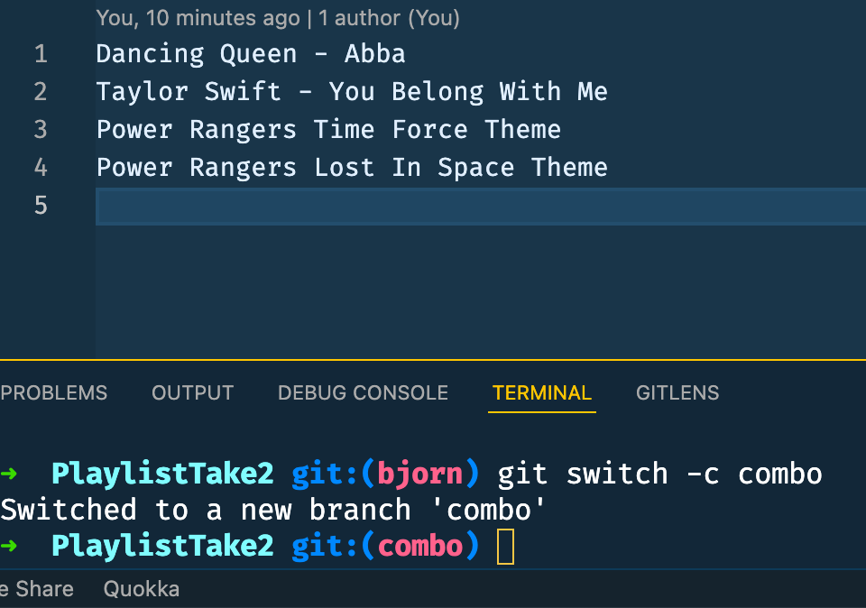
- Since we are on the bjorn branch, we can create a new branch called "combo" and merge <other branch> into the combo branch


This is what where we can accept what changes that are coming in.

## Section 8: Git Diff

- We can use the `git diff` command to view changes between commits, branches, files, our working directory, and more!
- WE often use git diff alongside commands like git status and git log, to get a better picture of a repository and how it has changed overtime.
- Purly an informative command as it does not do anything to the repo

Reasons to use Git Diff
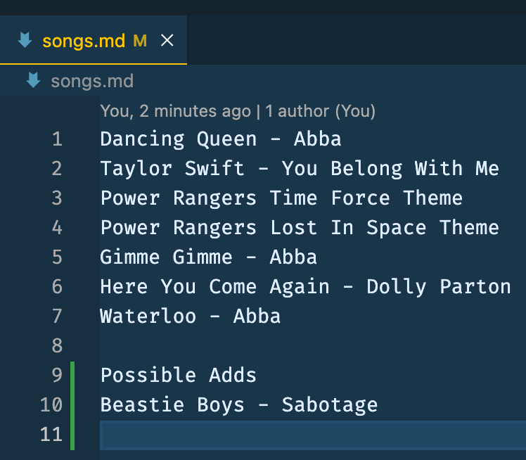
You see in the above example we added

```
Possible Adds
Beastie Boys - Sabotage
```

Let's say we had more files and documents that we worked on and don't remember what was done.

- We can use `git diff` to see what was changed

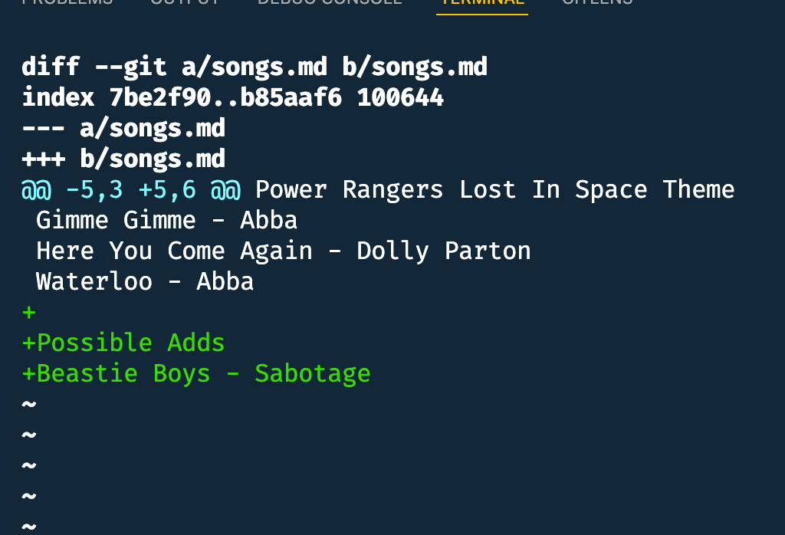

### Reading Guide to Git Diff

Note from picture above. You will see two files being compared. One will be labeled as a/songs.md and b/songs.md

The index line if about `File Metadata` and you really don't need to worry about this part. The First two numbers are the hashes of the two files being compared. The last number is an internal file mode identifier.

The `Markers` are assigned each a symbol. File A gets a (-) sign while file b gets a (+) sign.

Chunks - a diff won't show you the entire contents of a file, but instead only shows portins or "chunks" that were modified. A chunk also includes lines before and after a change to provide some context.

Git Diff - Without additional options, git diff lists all changes in our working directory that are not staged for next commit.
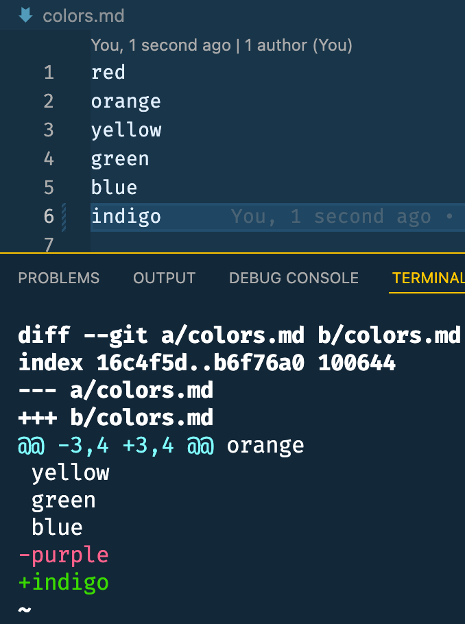

- We see purple had been taken out and indigo has been added
- Note that + does not always mean something new. It just means that it came from file b.

`git diff head` - Includes staged and unstaged changes since last commit

`git diff` shows all unstaged changes while `git diff --staged" shows all staged changes.

`git diff branch1..branch2` - git diff branch1..branch2 will list the changes between the tips of branch1 and branch2

`git diff commit1..commit2` - compares two commits, provide git diff with the commit hashes of the commits in question

- use `git log` to easier pull hashes and put the seven digit hash from git log.
  
- if we wanted to compare differences between "add red commit" and "add blue and purple" we would use `git diff 56129d6..56129d6`

## Section 9: Git Stash

Stashing - Git provides an easy way of stashing these uncommitted changes so that we can return to them later, without having to make unnecessary commits
`git stash`

`git stash pop` - to remove the most recently stashed changes in your stash and re-apply them to your working copy.

Sometimes if you make changes in a new branch and switch out of it, your changes may come with you assuming they don't conflict. It would be a fast forward merge if you did merge.

- note that if there are conflicts, git won't be happy.
  
- This is where `git stash` comes in. If you are not ready to commit or don't want to commit just yet.
- `git stash` will pause (to save your changes without commiting them)

Using git stash because you made changes but are not ready to commit them yet.


- type `git status` and you will see a clean working tree.
- you can now switch branches without conflicts
- when you are ready, you can go to whatever branch you wanted to add your changes to and use `git stash pop` to apply them

### Git Stash apply

`git stash apply` - to apply whatever is stashed away, without removing it from the stash. This can be useful if you want to apply stashed changes to multiple branches.

### Working with multiple stashes

`git stash list`


- We can reference particular stashes with the stash@{number} `git stash apply stash@{2}`

### Drop Stashes

`git stash drop stash@{number}` - to delete a particular stash

- note that only git stash pop will clear out that stash
- if we want to completely empty out the stash we can use `git stash clear`
  g
