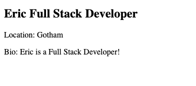
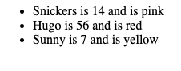

# JavaScript Literals

## Multiple lines without any funny business

Using HTML markup with a object

````js
      const person = {
         name: 'Eric',
         job: 'Full Stack Developer',
         city: 'Gotham',
         bio: 'Eric is a Full Stack Developer!',
      };

      const markup = `
    <div class="person">
      <h2>
        ${person.name}
        <span class="job">${person.job}</span>
      </h2>
      <p class="location">Location: ${person.city}</p>
      <p class="bio">Bio: ${person.bio}</p>
    </div>
  `;

      console.log(markup);
      document.body.innerHTML = markup;
      ```
````



Or nesting them inside each other with a list

```js
const dogs = [
  { name: "Snickers", age: 2, color: "pink" },
  { name: "Hugo", age: 8, color: "red" },
  { name: "Sunny", age: 1, color: "yellow" },
];

const markup = `
    <ul class="dogs">
      ${dogs
        .map(
          (dog) => `
        <li>
          ${dog.name}
          is
          ${dog.age * 7}
          and is
          ${dog.color}
        </li>`
        )
        .join("")}
    </ul>
  `;
document.body.innerHTML = markup;
```


